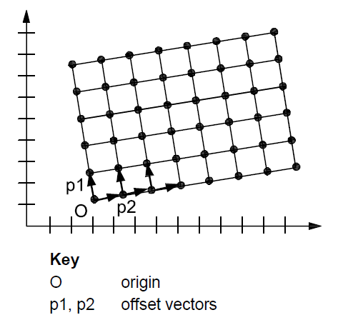
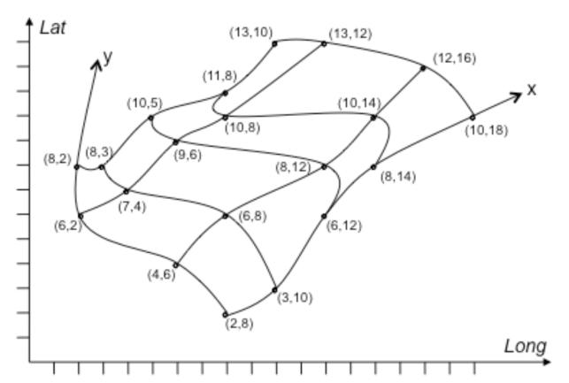

[[tg-applicationSchemasIncludedInTheIRs-article4]]

Articles 3, 4 and 5 of the Implementing Rules lay down the requirements for the content and structure of the data sets related to the INSPIRE Annex themes.

[REQUIREMENT, id="IR Requirement"]
======
__Article 4__ +
*Types for the Exchange of Classification of Spatial Objects*

. For the exchange and classification of spatial objects from data sets meeting the conditions laid down in _Article 4_ of Directive 2007/2/EC, Member States shall use the spatial object types and associated data types, enumerations and code lists that are defined in Annexes II, III and IV for the themes the data sets relate to. 
. Spatial object types and data types shall comply with the definitions and constraints and include the attributes and association roles set out in the Annexes. 
. The enumerations and code lists used in attributes or association roles of spatial object types or data types shall comply with the definitions and include the values set out in Annex II. The enumeration and code list values are uniquely identified by language-neutral mnemonic codes for computers. The values may also include a language-specific name to be used for human interaction.
======

[[tg-applicationSchemasIncludedInTheIRs-article3]]
The application schemas specify requirements on the properties of each spatial object including its multiplicity, domain of valid values, constraints, etc.

NOTE	The application schemas presented in this section contain some additional information that is not included in the Implementing Rules, in particular multiplicities of attributes and association roles.

[TGREQUIREMENT, id="TG Requirement 1"]
======
Spatial object types and data types shall comply with the multiplicities defined for the attributes and association roles in this section.
======

An application schema may include references (e.g. in attributes or inheritance relationships) to common types or types defined in other spatial data themes. These types can be found in a sub-section called ―Imported Types‖ at the end of each application schema section. The common types referred to from application schemas included in the IRs are addressed in _Article 3_.

[REQUIREMENT, id="IR Requirement"]
======
_Article 3_ +
*Common Types*

Types that are common to several of the themes listed in Annexes I, II and III to Directive 2007/2/EC shall conform to the definitions and constraints and include the attributes and association roles set out in Annex I.
======

NOTE	Since the IRs contain the types for all INSPIRE spatial data themes in one document, _Article 3_ does not explicitly refer to types defined in other spatial data themes, but only to types defined in external data models. 

Common types are described in detail in the Generic Conceptual Model [DS-D2.7], in the relevant international standards (e.g. of the ISO 19100 series) or in the documents on the common INSPIRE models [DS-D2.10.x]. For detailed descriptions of types defined in other spatial data themes, see the corresponding Data Specification TG document [DS-D2.8.x].

[[tg-additionalRecommendedApplicationSchemas]]

These additional application schemas are not included in the IRs. They typically address requirements from specific (groups of) use cases and/or may be used to provide additional information. They are included in this specification in order to improve interoperability also for these additional aspects and to illustrate the extensibility of the application schemas included in the IRs.

[[tg-basicNotions]]

== Basic notions

This section explains some of the basic notions used in the INSPIRE application schemas. These explanations are based on the GCM [DS-D2.5].

=== Notation

==== Unified Modelling Language (UML)

The application schemas included in this section are specified in UML, version 2.1. The spatial object types, their properties and associated types are shown in UML class diagrams. 

NOTE For an overview of the UML notation, see Annex D in [ISO 19103]. 

The use of a common conceptual schema language (i.e. UML) allows for an automated processing of application schemas and the encoding, querying and updating of data based on the application schema – across different themes and different levels of detail. 

The following important rules related to class inheritance and abstract classes are included in the IRs.

[REQUIREMENT, id="IR Requirement"]
======
_Article 5_ +
*Types*

(...)

[start=2]
. Types that are a sub-type of another type shall also include all this type‘s attributes and association roles.
. Abstract types shall not be instantiated.
======

The use of UML conforms to ISO 19109 8.3 and ISO/TS 19103 with the exception that UML 2.1 instead of ISO/IEC 19501 is being used. The use of UML also conforms to ISO 19136 E.2.1.1.1-E.2.1.1.4. 

NOTE ISO/TS 19103 and ISO 19109 specify a profile of UML to be used in conjunction with the ISO 19100 series. This includes in particular a list of stereotypes and basic types to be used in application schemas. ISO 19136 specifies a more restricted UML profile that allows for a direct encoding in XML Schema for data transfer purposes. 

To model constraints on the spatial object types and their properties, in particular to express data/data set consistency rules, OCL (Object Constraint Language) is used as described in ISO/TS 19103, whenever possible. In addition, all constraints are described in the feature catalogue in English, too. 

NOTE Since ―void‖ is not a concept supported by OCL, OCL constraints cannot include expressions to test whether a value is a void value. Such constraints may only be expressed in natural language.

==== Stereotypes

In the application schemas in this section several stereotypes are used that have been defined as part of a UML profile for use in INSPIRE [DS-D2.5]. These are explained in Table 1 below.

|=== 

| *Stereotype* | *Model element*  | *Description*  

| applicationSchema | Package | An INSPIRE application schema according to ISO 19109 and the Generic Conceptual Model.

| leaf | Package | A package that is not an application schema and contains no packages.

| featureType | Class | A spatial object type.

| type | Class | A type that is not directly instantiable, but is used as an abstract collection of operation, attribute and relation signatures. This stereotype should usually not be used in INSPIRE application schemas as these are on a different conceptual level than classifiers with this stereotype.

| dataType | Class | A structured data type without identity.

| union | Class | A structured data type without identity where exactly one of the properties of the type is present in any instance.

| enumeration | Class | An enumeration.

| codeList | Class | A code list.

| import | Dependency | The model elements of the supplier package are imported.

| voidable | Attribute, association role | A voidable attribute or association role (see section 5.2.2).

| lifeCycleInfo | Attribute, association role | If in an application schema a property is considered to be part of the life-cycle information of a spatial object type, the property shall receive this stereotype.

| version | Association role | If in an application schema an association role ends at a spatial object type, this stereotype denotes that the value of the property is meant to be a specific version of the spatial object, not the spatial object in general.

|=== 

=== Voidable characteristics

The «voidable» stereotype is used to characterise those properties of a spatial object that may not be present in some spatial data sets, even though they may be present or applicable in the real world. This does not mean that it is optional to provide a value for those properties. 

For all properties defined for a spatial object, a value has to be provided – either the corresponding value (if available in the data set maintained by the data provider) or the value of void. A void value shall imply that no corresponding value is contained in the source spatial data set maintained by the data provider or no corresponding value can be derived from existing values at reasonable costs.

[RECOMMENDATION, id="Recommendation {counter:rec-id}"]
======
The reason for a void value should be provided where possible using a listed value from the VoidReasonValue code list to indicate the reason for the missing value.
======

The VoidReasonValue type is a code list, which includes the following pre-defined values: 

- _Unpopulated_: The property is not part of the dataset maintained by the data provider. However, the characteristic may exist in the real world. For example when the ―elevation of the water body above the sea level‖ has not been included in a dataset containing lake spatial objects, then the reason for a void value of this property would be 'Unpopulated'. The property receives this value for all spatial objects in the spatial data set. 
- _Unknown_: The correct value for the specific spatial object is not known to, and not computable by the data provider. However, a correct value may exist. For example when the ―elevation of the water body above the sea level‖ of a certain lake has not been measured, then the reason for a void value of this property would be 'Unknown'. This value is applied only to those spatial objects where the property in question is not known. 
- _Withheld_: The characteristic may exist, but is confidential and not divulged by the data provider.

NOTE It is possible that additional reasons will be identified in the future, in particular to support reasons / special values in coverage ranges. 

The «voidable» stereotype does not give any information on whether or not a characteristic exists in the real world. This is expressed using the multiplicity: 

- If a characteristic may or may not exist in the real world, its minimum cardinality shall be defined as 0. For example, if an Address may or may not have a house number, the multiplicity of the corresponding property shall be 0..1. 
- If at least one value for a certain characteristic exists in the real world, the minimum cardinality shall be defined as 1. For example, if an Administrative Unit always has at least one name, the multiplicity of the corresponding property shall be 1..*. 

In both cases, the «voidable» stereotype can be applied. In cases where the minimum multiplicity is 0, the absence of a value indicates that it is known that no value exists, whereas a value of void indicates that it is not known whether a value exists or not. 

EXAMPLE If an address does not have a house number, the corresponding Address object should not have any value for the «voidable» attribute house number. If the house number is simply not known or not populated in the data set, the Address object should receive a value of void (with the corresponding void reason) for the house number attribute.

=== Enumerations

Enumerations are modelled as classes in the application schemas. Their values are modelled as attributes of the enumeration class using the following modelling style: 

- No initial value, but only the attribute name part, is used. 
- The attribute name conforms to the rules for attributes names, i.e. is a lowerCamelCase name. Exceptions are words that consist of all uppercase letters (acronyms).

[REQUIREMENT, id="IR Requirement"]
======
_Article 6_ +
*Code Lists and Enumerations*

(...)

[start=5]
. Attributes or association roles of spatial object types or data types that have an enumeration type may only take values from the lists specified for the enumeration type."
======

=== Code lists

Code lists are modelled as classes in the application schemas. Their values, however, are managed outside of the application schema.

==== Code list types

The IRs distinguish the following types of code lists.

[REQUIREMENT, id="IR Requirement"]
======
_Article 6_ +
*Code Lists and Enumerations*

(...)

[start=1]
. Code lists shall be of one of the following types, as specified in the Annexes: 
.. code lists whose allowed values comprise only the values specified in this Regulation; 
.. code lists whose allowed values comprise the values specified in this Regulation and narrower values defined by data providers;
.. code lists whose allowed values comprise the values specified in this Regulation and additional values at any level defined by data providers; 
.. code lists, whose allowed values comprise any values defined by data providers. 

For the purposes of points (b), (c) and (d), in addition to the allowed values, data providers may use the values specified in the relevant INSPIRE Technical Guidance document available on the INSPIRE web site of the Joint Research Centre.
======

The type of code list is represented in the UML model through the tagged value extensibility, which can take the following values: 

- _none_, representing code lists whose allowed values comprise only the values specified in the IRs (type a); 
- _narrower_, representing code lists whose allowed values comprise the values specified in the IRs and narrower values defined by data providers (type b); 
- _open_, representing code lists whose allowed values comprise the values specified in the IRs and additional values at any level defined by data providers (type c); and 
- _any_, representing code lists, for which the IRs do not specify any allowed values, i.e. whose allowed values comprise any values defined by data providers (type d).

[RECOMMENDATION, id="Recommendation {counter:rec-id}"]
======
Additional values defined by data providers should not replace or redefine any value already specified in the IRs.
======

NOTE This data specification may specify recommended values for some of the code lists of type (b), (c) and (d) (see section 5.2.4.3). These recommended values are specified in a dedicated Annex. 

In addition, code lists can be hierarchical, as explained in _Article 6_(2) of the IRs.

[REQUIREMENT, id="IR Requirement"]
======
_Article 6_ +
*Code Lists and Enumerations*

(...)

[start=2]
. Code lists may be hierarchical. Values of hierarchical code lists may have a more generic parent value. Where the valid values of a hierarchical code list are specified in a table in this Regulation, the parent values are listed in the last column.
======

The type of code list and whether it is hierarchical or not is also indicated in the feature catalogues.

==== Obligations on data providers

[REQUIREMENT, id="IR Requirement"]
======
_Article 6_ +
*Code Lists and Enumerations*

(...)

[start=3]
. Where, for an attribute whose type is a code list as referred to in points (b), (c) or (d) of paragraph 1, a data provider provides a value that is not specified in this Regulation, that value and its definition shall be made available in a register.
. Attributes or association roles of spatial object types or data types whose type is a code list may only take values that are allowed according to the specification of the code list.
======

_Article 6_(4) obliges data providers to use only values that are allowed according to the specification of the code list. The ―allowed values according to the specification of the code list‖ are the values explicitly defined in the IRs plus (in the case of code lists of type (b), (c) and (d)) additional values defined by data providers. 

For attributes whose type is a code list of type (b), (c) or (d) data providers may use additional values that are not defined in the IRs. _Article 6_(3) requires that such additional values and their definition be made available in a register. This enables users of the data to look up the meaning of the additional values used in a data set, and also facilitates the re-use of additional values by other data providers (potentially across Member States). 

NOTE Guidelines for setting up registers for additional values and how to register additional values in these registers is still an open discussion point between Member States and the Commission.

==== Recommended code list values

For code lists of type (b), (c) and (d), this data specification may propose additional values as a recommendation (in a dedicated Annex). These values will be included in the INSPIRE code list register. This will facilitate and encourage the usage of the recommended values by data providers since the obligation to make additional values defined by data providers available in a register (see section 5.2.4.2) is already met.

[RECOMMENDATION, id="Recommendation {counter:rec-id}"]
======
Where these Technical Guidelines recommend values for a code list in addition to those specified in the IRs, these values should be used.
======

NOTE For some code lists of type (d), no values may be specified in these Technical Guidelines. In these cases, any additional value defined by data providers may be used.

==== Governance

The following two types of code lists are distinguished in INSPIRE:

* _Code lists that are governed by INSPIRE (INSPIRE-governed code lists)_. These code lists will be managed centrally in the INSPIRE code list register. Change requests to these code lists (e.g. to add, deprecate or supersede values) are processed and decided upon using the INSPIRE code list register‘s maintenance workflows. +
INSPIRE-governed code lists will be made available in the INSPIRE code list register at http://inspire.ec.europa.eu/codeList/<CodeListName>. They will be available in SKOS/RDF, XML and HTML. The maintenance will follow the procedures defined in ISO 19135. This means that the only allowed changes to a code list are the addition, deprecation or supersession of values, i.e. no value will ever be deleted, but only receive different statuses (valid, deprecated, superseded). Identifiers for values of INSPIRE-governed code lists are constructed using the pattern http://inspire.ec.europa.eu/codeList/<CodeListName>/<value>.
* _Code lists that are governed by an organisation outside of INSPIRE (externally governed code lists)_. These code lists are managed by an organisation outside of INSPIRE, e.g. the World Meteorological Organization (WMO) or the World Health Organization (WHO). Change requests to these code lists follow the maintenance workflows defined by the maintaining organisations. Note that in some cases, no such workflows may be formally defined. +
Since the updates of externally governed code lists is outside the control of INSPIRE, the IRs and these Technical Guidelines reference a specific version for such code lists. +
The tables describing externally governed code lists in this section contain the following columns:
** The _Governance_ column describes the external organisation that is responsible for maintaining the code list.
** The _Source_ column specifies a citation for the authoritative source for the values of the code list. For code lists, whose values are mandated in the IRs, this citation should include the version of the code list used in INSPIRE. The version can be specified using a version number or the publication date. For code list values recommended in these Technical Guidelines, the citation may refer to the ―latest available version‖.
** In some cases, for INSPIRE only a subset of an externally governed code list is relevant. The subset is specified using the _Subset_ column.
** The _Availability_ column specifies from where (e.g. URL) the values of the externally governed code list are available, and in which formats. Formats can include machine-readable (e.g. SKOS/RDF, XML) or human-readable (e.g. HTML, PDF) ones.

Code list values are encoded using http URIs and labels. Rules for generating these URIs and labels are specified in a separate table.

[RECOMMENDATION, id="Recommendation {counter:rec-id}"]
======
The http URIs and labels used for encoding code list values should be taken from the INSPIRE code list registry for INSPIRE-governed code lists and generated according to the relevant rules specified for externally governed code lists.
======

NOTE Where practicable, the INSPIRE code list register could also provide http URIs and labels for externally governed code lists.

==== Vocabulary

For each code list, a tagged value called ―vocabulary‖ is specified to define a URI identifying the values of the code list. For INSPIRE-governed code lists and externally governed code lists that do not have a persistent identifier, the URI is constructed following the pattern http://inspire.ec.europa.eu/codeList/<UpperCamelCaseName>. 

If the value is missing or empty, this indicates an empty code list. If no sub-classes are defined for this empty code list, this means that any code list may be used that meets the given definition. 

An empty code list may also be used as a super-class for a number of specific code lists whose values may be used to specify the attribute value. If the sub-classes specified in the model represent all valid extensions to the empty code list, the subtyping relationship is qualified with the standard UML constraint "{complete,disjoint}".

[[tg-identifierManagement]]
=== Identifier management

[REQUIREMENT, id="IR Requirement"]
======
_Article 9_ +
*Identifier Management*

. The data type Identifier defined in Section 2.1 of Annex I shall be used as a type for the external object identifier of a spatial object.
. The external object identifier for the unique identification of spatial objects shall not be changed during the life-cycle of a spatial object.
======

NOTE 1 An external object identifier is a unique object identifier which is published by the responsible body, which may be used by external applications to reference the spatial object. [DS-D2.5] 

NOTE 2 _Article 9_(1) is implemented in each application schema by including the attribute inspireId of type Identifier. 

NOTE 3 _Article 9_(2) is ensured if the namespace and localId attributes of the Identifier remains the same for different versions of a spatial object; the version attribute can of course change.

[[tg-geometryRepresentation]]

=== Geometry representation

[REQUIREMENT, id="IR Requirement"]
======
_Article 9_ +
*Other Requirements & Rules*

. The value domain of spatial properties defined in this Regulation shall be restricted to the Simple Feature spatial schema as defined in Herring, John R. (ed.), OpenGIS® Implementation Standard for Geographic information – Simple feature access – Part 1: Common architecture, version 1.2.1, Open Geospatial Consortium, 2011, unless specified otherwise for a specific spatial data theme or type.
======

NOTE 1 The specification restricts the spatial schema to 0-, 1-, 2-, and 2.5-dimensional geometries where all curve interpolations are linear and surface interpolations are performed by triangles. 

NOTE 2 The topological relations of two spatial objects based on their specific geometry and topology properties can in principle be investigated by invoking the operations of the types defined in ISO 19107 (or the methods specified in EN ISO 19125-1).

[[tg-temporalityRepresentation]]

The application schema(s) use(s) the derived attributes "beginLifespanVersion" and "endLifespanVersion" to record the lifespan of a spatial object.

The attributes "beginLifespanVersion" specifies the date and time at which this version of the spatial object was inserted or changed in the spatial data set. The attribute "endLifespanVersion" specifies the date and time at which this version of the spatial object was superseded or retired in the spatial data set.

NOTE 1 The attributes specify the beginning of the lifespan of the version in the spatial data set itself, which is different from the temporal characteristics of the real-world phenomenon described by the spatial object. This lifespan information, if available, supports mainly two requirements: First, knowledge about the spatial data set content at a specific time; second, knowledge about changes to a data set in a specific time frame. The lifespan information should be as detailed as in the data set (i.e., if the lifespan information in the data set includes seconds, the seconds should be represented in data published in INSPIRE) and include time zone information. 

NOTE 2 Changes to the attribute "endLifespanVersion" does not trigger a change in the attribute "beginLifespanVersion".

[REQUIREMENT, id="IR Requirement"]
======
_Article 10_ +
*Life-cycle of Spatial Objects*

(...)

[start=3]
. Where the attributes beginLifespanVersion and endLifespanVersion are used, the value of endLifespanVersion shall not be before the value of beginLifespanVersion.
======

NOTE The requirement expressed in the IR Requirement above will be included as constraints in the UML data models of all themes.

[RECOMMENDATION, id="Recommendation {counter:rec-id}"]
======
If life-cycle information is not maintained as part of the spatial data set, all spatial objects belonging to this data set should provide a void value with a reason of "unpopulated".
======

[[tg-validityOfTheRealWorldPhenomena]]

The application schema(s) use(s) the attributes "validFrom" and "validTo" to record the validity of the real-world phenomenon represented by a spatial object. 

The attributes "validFrom" specifies the date and time at which the real-world phenomenon became valid in the real world. The attribute "validTo" specifies the date and time at which the real-world phenomenon is no longer valid in the real world. 

Specific application schemas may give examples what ―being valid‖ means for a specific real-world phenomenon represented by a spatial object.

[REQUIREMENT, id="IR Requirement"]
======
_Article 12_ +
*Other Requirements & Rules*

(...)

[start=3]
. Where the attributes validFrom and validTo are used, the value of validTo shall not be before the value of validFrom.
======

NOTE The requirement expressed in the IR Requirement above will be included as constraints in the UML data models of all themes.

[[tg-coverages]]

Coverage functions are used to describe characteristics of real-world phenomena that vary over space and/or time. Typical examples are temperature, elevation, precipitation, imagery. A coverage contains a set of such values, each associated with one of the elements in a spatial, temporal or spatio-temporal domain. Typical spatial domains are point sets (e.g. sensor locations), curve sets (e.g. isolines), grids (e.g. orthoimages, elevation models), etc. 

In INSPIRE application schemas, coverage functions are defined as properties of spatial object types where the type of the property value is a realisation of one of the types specified in ISO 19123. 

To improve alignment with coverage standards on the implementation level (e.g. ISO 19136 and the OGC Web Coverage Service) and to improve the cross-theme harmonisation on the use of coverages in INSPIRE, an application schema for coverage types is included in the Generic Conceptual Model in 9.9.4. This application schema contains the following coverage types: 

- RectifiedGridCoverage: coverage whose domain consists of a rectified grid – a grid for which there is an affine transformation between the grid coordinates and the coordinates of a coordinate reference system (see <<rectifiedGrid>>). 
- ReferenceableGridCoverage: coverage whose domain consists of a referenceable grid – a grid associated with a transformation that can be used to convert grid coordinate values to values of coordinates referenced to a coordinate reference system (see <<referenceableGrid>>). 

In addition, some themes make reference to the types TimeValuePair and Timeseries defined in Taylor, Peter (ed.), OGC® WaterML 2.0: Part 1 – Timeseries, v2.0.0, Open Geospatial Consortium, 2012. These provide a representation of the time instant/value pairs, i.e. time series (see Figure 3). 

Where possible, only these coverage types (or a subtype thereof) are used in INSPIRE application schemas.

include::tg-dataContentAndStructure.adoc[rectifiedGrid]

include::tg-dataContentAndStructure.adoc[referenceableGrid]

[[rectifiedGrid]]

[[referenceableGrid]]
.Examples of a rectified grid (left) and a referenceable grid (right)
